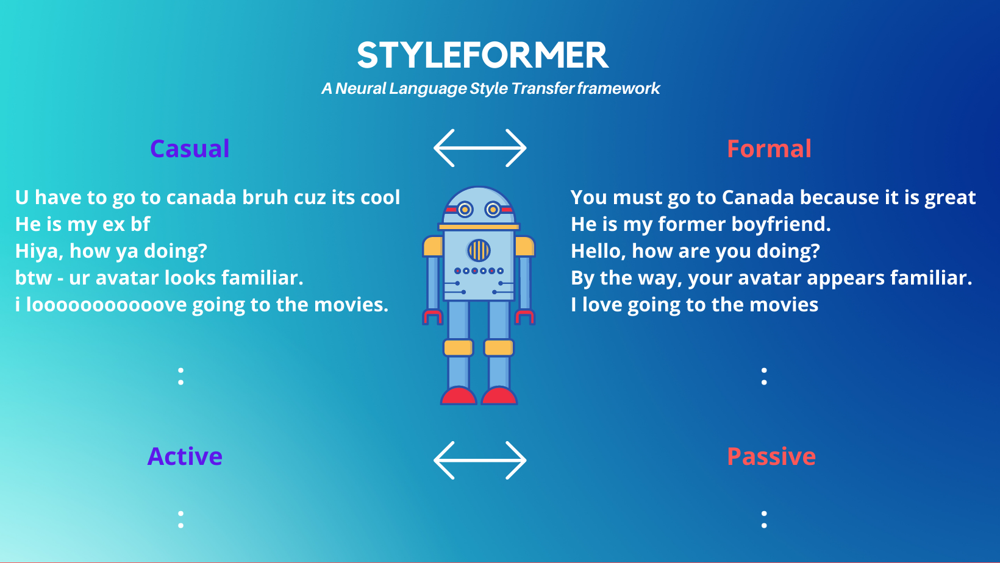

[](https://github.com/PrithivirajDamodaran/Styleformer/blob/main/LICENSE)
[](https://badges.pufler.dev)


<p align="center">
    
</p>

# Styleformer
A Neural Language Style Transfer framework to transfer natural language text smoothly between fine-grained language styles like formal/casual, active/passive, and many more.For instance, understand [What makes text formal or casual/informal](https://www.niu.edu/writingtutorial/style/formal-and-informal-style.shtml).

## Table of contents
- [Usecases for Styleformer](#usecases-for-styleformer)
- [Installation](#installation)
- [Quick Start](#quick-start)
  * [Casual to Formal (Available now !)](#casual-to-formal--available-now---)
  * [Formal to Casual (Available now !)](#formal-to-casual--available-now---)
  * [Active to Passive (Available now !)](#active-to-passive--available-now---)
  * [Passive to Active (Available now !)](#passive-to-active--available-now---)
- [Knobs](#knobs)
- [Models](#models)
- [Dataset](#dataset)
- [Benchmark](#benchmark)
- [Streamlit Demo](#streamlit-demo)
- [References](#references)
- [Citation](#citation)

## Usecases for Styleformer

**Area 1: Data Augmentation**
- Augment training datasets with various fine-grained language styles.

**Area 2: Post-processing**
- Apply style transfers to machine generated text. 
- e.g.
    - Refine a Summarised text to active voice + formal tone.
    - Refine a Translated text to more casual tone to reach younger audience.

**Area 3: Controlled paraphrasing**
- Formal <=> Casual and Active <=> style transfers adds a notion of control over how we paraphrase when compared to free-form paraphrase where there is control or guarantee over the paraphrases.

**Area 4: Assisted writing**
- Integrate this to any human writing interfaces like email clients, messaging tools or social media post authoring tools. Your creativity is your limit to te uses. 
- e.g.
    - Polish an email with business tone for professional uses.

## Installation
```python
pip install git+https://github.com/PrithivirajDamodaran/Styleformer.git
```
## Quick Start

### Casual to Formal (Available now !)
```python
from styleformer import Styleformer
import torch
import warnings
warnings.filterwarnings("ignore")

'''
#uncomment for re-producability
def set_seed(seed):
  torch.manual_seed(seed)
  if torch.cuda.is_available():
    torch.cuda.manual_seed_all(seed)

set_seed(1234)
'''

# style = [0=Casual to Formal, 1=Formal to Casual, 2=Active to Passive, 3=Passive to Active etc..]
sf = Styleformer(style = 0) 

source_sentences = [
"I am quitting my job",
"Jimmy is on crack and can't trust him",
"What do guys do to show that they like a gal?",
"i loooooooooooooooooooooooove going to the movies.",
"That movie was fucking awesome",
"My mom is doing fine",
"That was funny LOL" , 
"It's piece of cake, we can do it",
"btw - ur avatar looks familiar",
"who gives a crap?",
"Howdy Lucy! been ages since we last met.",
"Dude, this car's dope!",
"She's my bestie from college",
"I kinda have a feeling that he has a crush on you.",
"OMG! It's finger-lickin' good.",
]   

for source_sentence in source_sentences:
    target_sentence = sf.transfer(source_sentence)
    print("-" *100)
    print("[Casual] ", source_sentence)
    print("-" *100)
    if target_sentence is not None:
        print("[Formal] ",target_sentence)
        print()
    else:
        print("No good quality transfers available !")
```

```
[Casual]  I am quitting my job
[Formal]  I will be stepping down from my job.
----------------------------------------------------------------------------------------------------
[Casual]  Jimmy is on crack and can't trust him
[Formal]  Jimmy is a crack addict I cannot trust him
----------------------------------------------------------------------------------------------------
[Casual]  What do guys do to show that they like a gal?
[Formal]  What do guys do to demonstrate their affinity for women?
----------------------------------------------------------------------------------------------------
[Casual]  i loooooooooooooooooooooooove going to the movies.
[Formal]  I really like to go to the movies.
----------------------------------------------------------------------------------------------------
[Casual]  That movie was fucking awesome
[Formal]  That movie was wonderful.
----------------------------------------------------------------------------------------------------
[Casual]  My mom is doing fine
[Formal]  My mother is doing well.
----------------------------------------------------------------------------------------------------
[Casual]  That was funny LOL
[Formal]  That was hilarious
----------------------------------------------------------------------------------------------------
[Casual]  It's piece of cake, we can do it
[Formal]  The whole process is simple and is possible.
----------------------------------------------------------------------------------------------------
[Casual]  btw - ur avatar looks familiar
[Formal]  Also, your avatar looks familiar.
----------------------------------------------------------------------------------------------------
[Casual]  who gives a crap?
[Formal]  Who cares?
----------------------------------------------------------------------------------------------------
[Casual]  Howdy Lucy! been ages since we last met.
[Formal]  Hello, Lucy It has been a long time since we last met.
----------------------------------------------------------------------------------------------------
[Casual]  Dude, this car's dope!
[Formal]  I find this car very appealing.
----------------------------------------------------------------------------------------------------
[Casual]  She's my bestie from college
[Formal]  She is my best friend from college.
----------------------------------------------------------------------------------------------------
[Casual]  I kinda have a feeling that he has a crush on you.
[Formal]  I have a feeling that he is attracted to you.
----------------------------------------------------------------------------------------------------
[Casual]  OMG! It's finger-lickin' good.
[Formal]  It is so good, it is delicious.
----------------------------------------------------------------------------------------------------
```

### Formal to Casual (Available now !)
```python
from styleformer import Styleformer
import warnings
warnings.filterwarnings("ignore")

# style = [0=Casual to Formal, 1=Formal to Casual, 2=Active to Passive, 3=Passive to Active etc..]
sf = Styleformer(style = 1) 
import torch
def set_seed(seed):
  torch.manual_seed(seed)
  if torch.cuda.is_available():
    torch.cuda.manual_seed_all(seed)

set_seed(1212)

source_sentences = [
"I would love to meet attractive men in town",
"Please leave the room now",
"It is a delicious icecream",
"I am not paying this kind of money for that nonsense",
"He is on cocaine and he cannot be trusted with this",
"He is a very nice man and has a charming personality",
"Let us go out for dinner",
"We went to Barcelona for the weekend. We have a lot of things to tell you.",
]   

for source_sentence in source_sentences:
    # inference_on = [0=Regular model On CPU, 1= Regular model On GPU, 2=Quantized model On CPU]
    target_sentence = sf.transfer(source_sentence, inference_on=0, quality_filter=0.95, max_candidates=5)
    print("[Formal] ", source_sentence)
    if target_sentence is not None:
        print("[Casual] ",target_sentence)
    else:
        print("No good quality transfers available !")
    print("-" *100)        
```

```
[Formal]  I would love to meet attractive men in town
[Casual]  i want to meet hot guys in town
----------------------------------------------------------------------------------------------------
[Formal]  Please leave the room now
[Casual]  leave the room now.
----------------------------------------------------------------------------------------------------
[Formal]  It is a delicious icecream
[Casual]  It is a yummy icecream
----------------------------------------------------------------------------------------------------
[Formal]  I am not paying this kind of money for that nonsense
[Casual]  But I'm not paying this kind of money for that crap
----------------------------------------------------------------------------------------------------
[Formal]  He is on cocaine and he cannot be trusted with this
[Casual]  he is on coke and he can't be trusted with this
----------------------------------------------------------------------------------------------------
[Formal]  He is a very nice man and has a charming personality
[Casual]  he is a really nice guy with a cute personality.
----------------------------------------------------------------------------------------------------
[Formal]  Let us go out for dinner
[Casual]  let's hang out for dinner.
----------------------------------------------------------------------------------------------------
[Formal]  We went to Barcelona for the weekend. We have a lot of things to tell you.
[Casual]  hehe..we went to barcelona for the weekend..we got a lot of things to tell ya..
----------------------------------------------------------------------------------------------------
```

### Active to Passive (Available now !)
```python
# style = [0=Casual to Formal, 1=Formal to Casual, 2=Active to Passive, 3=Passive to Active etc..]
sf = Styleformer(style = 2) 
```
### Passive to Active (Available now !)
```python
# style = [0=Casual to Formal, 1=Formal to Casual, 2=Active to Passive, 3=Passive to Active etc..]
sf = Styleformer(style = 3) 
```

## Knobs

```python
# inference_on = [0=Regular model On CPU, 1= Regular model On GPU, 2=Quantized model On CPU]
target_sentence = sf.transfer(source_sentence, inference_on=0, quality_filter=0.95, max_candidates=5)
```

## Models

|      Model          |Type                          |Status                         
|----------------|-------------------------------|-----------------------------|
|[prithivida/informal_to_formal_styletransfer](https://huggingface.co/prithivida/informal_to_formal_styletransfer)|Seq2Seq |Beta
|[prithivida/formal_to_informal_styletransfer](https://huggingface.co/prithivida/formal_to_informal_styletransfer)|Seq2Seq    |Beta|
|[prithivida/active_to_passive_styletransfer](https://huggingface.co/prithivida/active_to_passive_styletransfer)|Seq2Seq    |Beta|
|[prithivida/passive_to_active_styletransfer](https://huggingface.co/prithivida/passive_to_active_styletransfer)|Seq2Seq    |Beta|
|prithivida/positive_to_negative_styletransfer|Seq2Seq    |WIP|
|prithivida/negative_to_positive_styletransfer|Seq2Seq    |WIP|


## Dataset
- The casual <=> formal dataset was generated using ideas mentioned in reference paper 1
- The positive <=> negative dataset was generated using ideas mentioned in reference paper 3
- Fined tuned on T5 on a Tesla T4 GPU and it took ~2 hours to train each of the above models with batch_size = 16 and epochs = 5.(Will share training args shortly)

## Benchmark
- TBD

## Streamlit Demo
```
pip install streamlit
streamlit run streamlit_app.py
```

## References
- [Formality Style Transfer for Noisy Text: Leveraging Out-of-Domain
Parallel Data for In-Domain Training via POS Masking](https://www.aclweb.org/anthology/D19-5502.pdf)
- [Generative Text Style Transfer for Improved Language Sophistication](http://cs230.stanford.edu/projects_winter_2020/reports/32069807.pdf)
- [Delete, Retrieve, Generate: A Simple Approach to Sentiment and Style Transfer](https://arxiv.org/pdf/1804.06437.pdf)

## Citation
- TBD


